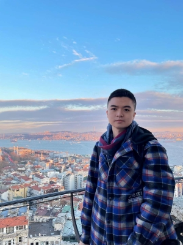

---
hide:
  - navigation
---

# **Fred** Houze Li
{align="left" style="margin-right: 60px"}

### 李厚泽   (Lee-Hou-Tse) 

Welcome to my personal website! I am **Fred**, currently pursuing a Master's degree in Quantitative Finance at Washington University in St. Louis (WashU). Prior to that, I had a background in in Economics and Finance from The University of Hong Kong (HKU).

I am passionate about data-driven financial analysis, quantitative capital market research, and integrating quantitative methods into political research. My interest spans programming, machine learning, and traditional financial tools.

Feel free to explore my [**Projects**](projects.md), view my [**Resume**](cv.md), check my [**Sample Codes**](sample_codes.md), or learn more about my [**Personal Life**](personal.md) – including my travel photography collection and my cat "小i" (Little-i)!

## **News**
- **November 1, 2024**: Welcome to my new website!
