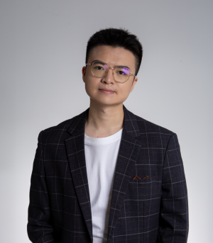

---
hide:
  - navigation
---

# **Fred** Houze Li

### 李厚澤   (Lee-Hou-Tse) 

{align="right" style="margin-left: 50px"}

Welcome to my personal website! I am **Fred**, currently pursuing a Master's degree in Quantitative Finance at Washington University in St. Louis (WashU). With a background in Economics and Finance from The University of Hong Kong (HKU), I am passionate about data-driven financial analysis, quantitative capital market research, and integrating quantitative methods into political research.

My interest spans programming, machine learning, and traditional financial tools. I've previously co-managed portfolios up to US$200 million and am recently contributing to research in macroeconomic policy analysis.

Feel free to explore my [**Projects**](projects.md), view my [**Resume**](cv.md), check my [**Sample Codes**](sample_codes.md), or learn more about my [**Personal Life**](personal.md) – including my introverted cat "小i" (Little-i)!

## **News**
- **November 2, 2024**: A new project is going on! But the repository is private for now.
- **November 1, 2024**: Welcome to my new website!
