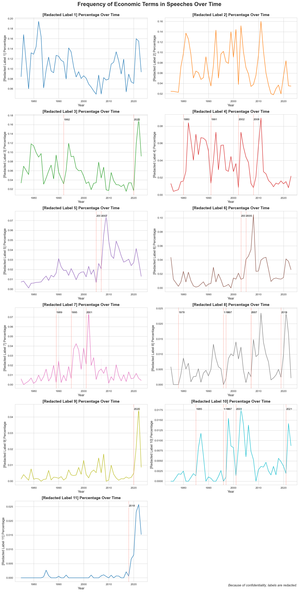

# **Research & Projects**

Here are my ongoing and completed projects:

## **Projects**
### Secret Price Prediction Prop Trading Strategy (Just Started)
- Private GitHub Repository
- This project involves building a machine learning model to predict stock prices using historical data. The project leverages various statistical techniques and data preprocessing methods to enhance prediction accuracy.

### Automatic Cover Letter Generator
- [GitHub Repository](https://github.com/fredhli/Auto_CL_Generator)
- This project focuses on creating an automatic cover letter generator using natural language processing techniques. The generator customizes cover letters based on user input and job descriptions to streamline the job application process.

### Hull-White Model Calibration
- [GitHub Repository](https://github.com/fredhli/Hull-White-Caplet-Calibration)
- This project focuses on the intricate task of calibrating the Hull-White model to at-the-money (ATM) caplet market implied volatilities. Through a meticulous process that involves both theoretical and simulation-based approaches, we aim to bridge the gap between model predictions and market observations. Our endeavor is not just an academic exercise but a deep dive into the dynamics of fixed income derivatives, exploring the nuances of the Hull-White model and its practical applications in today's financial markets.

## **Research Experience**
### Text-based Analysis using Novel Dataset

We used a novel dataset of **U.S. congressional hearings**. After rigorously addressing *OCR reading errors* and [mapping database speakers](text-based-codes.md) to real-world congressmen, our next step is to train a **BERT topic model** to condense hundreds of thousands of speeches in the dataset into *500 topics*. 

#### Plot 1
Following fine-tuning (including *embedding pretraining*, *vectorizer model*, *UMAP model*, *HDBSCAN model*, *c-TF-IDF model*, and *representation model*), this is an interactive map of the **top 20 most frequent topics**. Feel free to explore the data:

<iframe src="/assets/plots/topic_500.html" width="100%" height="1000px" style="border:none;"></iframe>

#### Plot 2
Here is another plot which depicits the frequency of how congressmen mentions a certain redacted label over time, labelled by AI-Large Language Models (LLMs). 

{ align=left }

### The Casual Impact of Fiscal Shock