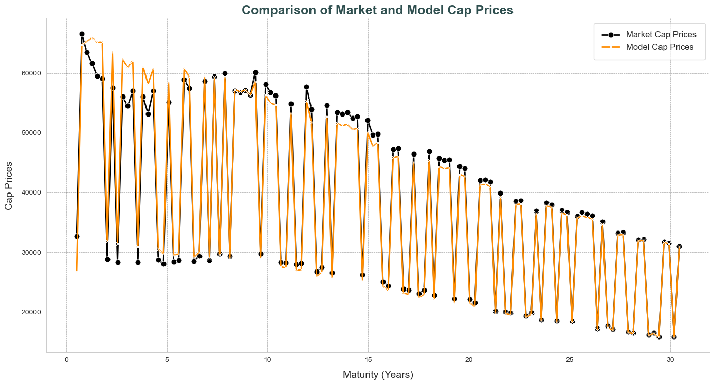

# **Projects**

Here are my ongoing and completed projects:

## **Price Prediction Prop Trading Strategy** (Just Started)
- GitHub Repository TBA
- This project involves building a machine learning model to predict stock prices using historical data. The project leverages various statistical techniques and data preprocessing methods to enhance prediction accuracy.


## [**Hull-White Model Calibration**](https://github.com/fredhli/Hull-White-Caplet-Calibration)
### Description
This project focuses on the intricate task of calibrating the **Hull-White model** to at-the-money (ATM) caplet market implied volatilities. Through a meticulous process involving both theoretical and simulation-based approaches, we bridged the gap between model predictions and market observations. This project delves into the dynamics of fixed income derivatives, exploring the market movements of the Hull-White model and its practical applications in today's financial markets.

### Hull-White Model

$$
\begin{aligned}
&dr(t) = \theta(t) - a \cdot r(t) \, dt + \sigma \cdot dW(t) \\ \\
&\text{where,} \\
&\theta(t) = \frac{\partial f(0,t)}{\partial t} + a \cdot f(0,t) + \frac{\sigma^2}{2 a} \left(1 - e^{-2  a t}\right) \\ \\
\end{aligned}
$$

### Methodology
To increase the sample size, we combined different caplets to obtain 120 caps from 120 caplets, spanning various maturities, for the calibration process. The calibration involved solving an optimization problem where the objective function was to minimize the sum of squared differences between the model-implied volatilities and the observed market volatilities. Additionally, we employed **Monte-Carlo Simulation** methods to make our pricing model accurate, and to ensuring robustness and reliability of the results.

{ align=left }

### Output
#### Result
Our calibration results:

```python
output_params[0] = 0.01335      # a
output_params[1] = 0.02013      # sigma
output_params[2] = 0.04815      # r_0
```

#### Plot
The model results in around 11.3% in overall function value loss, but the model's performance **improves with longer maturities**. This indicates that our calibration is particularly **effective for pricing long-term interest rate derivatives**.

{ align=left }

## [**Automatic Cover Letter Generator**](https://github.com/fredhli/Auto_CL_Generator)

This project focuses on creating an automatic cover letter generator using natural language processing techniques.
### Description
This project automates the process of using AI API to generate well-organized, highly-tailored cover letters during your job hunt. It allows you to manage multiple versions of your CV and lets AI help you choose which CV to use based on the required skillsets in job descriptions.

### Features
- **CV Management**: Store and manage multiple versions of your CV.
- **JD Analysis**: Extract key requirements and skills from job descriptions.
- **Company Address Search Up**: Use Google Map API to automate the company address hunt process.
- **CV-JD Matching**: AI-powered matching of CV versions to job requirements.
- **Cover Letter Generation**: Automated creation of personalized cover letters using Notion API.
- **API Integration**: Seamless interaction with ChatGPT API.
- **Configuration Options**: Customize output format and style preferences.
- **Centralized Storage of Application History**: Keep track of all your job applications and generated cover letters in one place for easy reference and follow-up.


