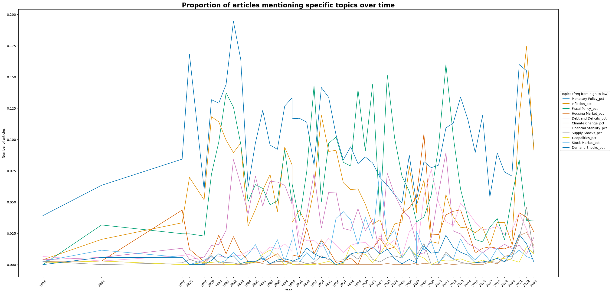

# **Research & Projects**

Here are my ongoing and completed projects:

## Projects
### Jane Street Kaggle Price Prediction
- Private GitHub Repository
This project involves building a machine learning model to predict stock prices using historical data. The project leverages various statistical techniques and data preprocessing methods to enhance prediction accuracy.

### Automatic Cover Letter Generator
- [GitHub Repository](https://github.com/fredhli/Auto_CL_Generator)
- This project focuses on creating an automatic cover letter generator using natural language processing techniques. The generator customizes cover letters based on user input and job descriptions to streamline the job application process.


### Hull-White Model Calibration

## Research Experience
### The Casual Impact of Fiscal Shock

### Text-based Analysis using Novel Dataset

We used a novel dataset of **U.S. congressional hearings**. After rigorously addressing *OCR reading errors* and [mapping database speakers](text-based-codes.md) to real-world congressmen, our next step is to train a **BERT topic model** to condense hundreds of thousands of speeches in the dataset into *500 topics*. 

Following fine-tuning (including *embedding pretraining*, *vectorizer model*, *UMAP model*, *HDBSCAN model*, *c-TF-IDF model*, and *representation model*), this is an interactive map of the **top 20 most frequent topics**. Feel free to explore the data:

<iframe src="/assets/plots/topic_500.html" width="100%" height="1000px" style="border:none;"></iframe>

<!-- { align=left } -->

```python

```