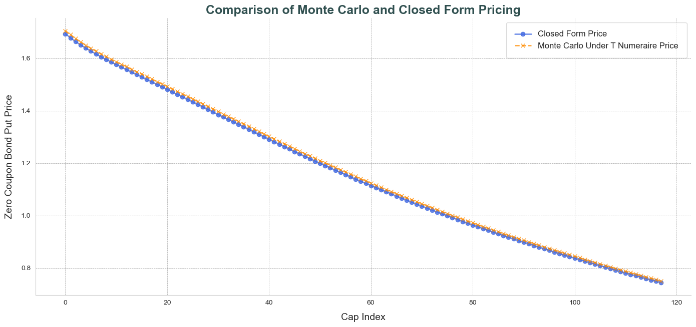

# **Research & Projects**

Here are my ongoing and completed projects:

## **Projects**
### **Price Prediction Prop Trading Strategy** (Just Started)
- GitHub Repository TBA
- This project involves building a machine learning model to predict stock prices using historical data. The project leverages various statistical techniques and data preprocessing methods to enhance prediction accuracy.


### [**Hull-White Model Calibration**](https://github.com/fredhli/Hull-White-Caplet-Calibration)
#### Description
This project focuses on the intricate task of calibrating the **Hull-White model** to at-the-money (ATM) caplet market implied volatilities. Through a meticulous process involving both theoretical and simulation-based approaches, we bridged the gap between model predictions and market observations. This project delves into the dynamics of fixed income derivatives, exploring the market movements of the Hull-White model and its practical applications in today's financial markets.

#### Methodology
To increase the sample size, we combined different caplets to obtain 120 caps from 120 caplets, spanning various maturities, for the calibration process. The calibration involved solving an optimization problem where the objective function was to minimize the sum of squared differences between the model-implied volatilities and the observed market volatilities. Additionally, we employed **Monte-Carlo Simulation** methods to make our pricing model accurate, and to ensuring robustness and reliability of the results.

{ align=left }

#### Output
Our calibration results for Hull-White short-rate model:

$$
\begin{aligned}
&dr(t) = \theta(t) - 0.01335 \cdot r(t) \, dt + 0.02013 \cdot dW(t) \\ \\
&\text{where,} \\
&\theta(t) = \frac{\partial f(0,t)}{\partial t} + 0.01335 \cdot f(0,t) + \frac{\sigma^2}{2 0.01335} \left(1 - e^{-2 \times 0.01335 t}\right) \\
&r(0) = 0.04815
\end{aligned}
$$

#### Plot
The calibration resulted in an around 7% loss in function value.

{ align=left }

### [**Automatic Cover Letter Generator**](https://github.com/fredhli/Auto_CL_Generator)

This project focuses on creating an automatic cover letter generator using natural language processing techniques.
#### Description
This project automates the process of using AI API to generate well-organized, highly-tailored cover letters during your job hunt. It allows you to manage multiple versions of your CV and lets AI help you choose which CV to use based on the required skillsets in job descriptions.

#### Features
- **CV Management**: Store and manage multiple versions of your CV.
- **JD Analysis**: Extract key requirements and skills from job descriptions.
- **Company Address Search Up**: Use Google Map API to automate the company address hunt process.
- **CV-JD Matching**: AI-powered matching of CV versions to job requirements.
- **Cover Letter Generation**: Automated creation of personalized cover letters using Notion API.
- **API Integration**: Seamless interaction with ChatGPT API.
- **Configuration Options**: Customize output format and style preferences.
- **Centralized Storage of Application History**: Keep track of all your job applications and generated cover letters in one place for easy reference and follow-up.


## **Research Experience**
### Text-based Analysis using Novel Dataset

We used a novel dataset of **U.S. congressional hearings**. After rigorously addressing *OCR reading errors* and [mapping database speakers](text-based-codes.md) to real-world congressmen, our next step is to train a **BERT topic model** to condense hundreds of thousands of speeches in the dataset into *500 topics*. 

#### Plot 1
Following fine-tuning (including *embedding pretraining*, *vectorizer model*, *UMAP model*, *HDBSCAN model*, *c-TF-IDF model*, and *representation model*), this is an interactive map of the **top 20 most frequent topics**. Feel free to explore the data:

<iframe src="/assets/plots/topic_500.html" width="100%" height="1000px" style="border:none;"></iframe>

#### Plot 2
Here is another plot which depicits the frequency of how congressmen mentions a certain redacted label over time, labelled by AI-Large Language Models (LLMs). 

{ align=left }

### The Casual Impact of Fiscal Shock

This research investigates how government deficits and public debt levels influence asset prices and macroeconomic conditions. Using event study methodology, we analyze periods where UK budget deficit news emerged independently of economic conditions, addressing the omitted variable bias challenge (OVB). We employ **Large Language Models (LLMs)** to extract **budget surprises** from news data and examine their impact on financial markets.

We obtained `q1_ratio` by utilizing an AI LLMs to assess news articles related to budget announcements. For each article, the model answered two specific questions about whether the news would cause the budget deficit to increase or decrease. The responses were categorized as 'up', 'down', or 'unsure'. The `q1_ratio` is calculated as a normalized measure using the proportions of 'up' and 'down' responses:

$$\text{q1_ratio} = \frac{\text{q1_up} - \text{q1_down}}{\text{q1_up} + \text{q1_down}}$$

Then, we conducted following regression analysis:

```
q1_ratio ~ 10.0_n + gbpusd_o
```

- 10.0_n: change in UK 10-year bond yield between announcement date `t+5` and `t-1`  

- gbpusd_o: change in GBP/USD Exchange Rate between announcement date `t+5` and `t-1`  

Here are the preliminary regression results:

```
                            OLS Regression Results                            
==============================================================================
Dep. Variable:                 10.0_n   R-squared:                       0.399
Model:                            OLS   Adj. R-squared:                  0.373
Method:                 Least Squares   F-statistic:                     15.25
Date:                Sat, 02 Nov 2024   Prob (F-statistic):           1.03e-07
Time:                        23:57:16   Log-Likelihood:                 45.267
No. Observations:                  73   AIC:                            -82.53
Df Residuals:                      69   BIC:                            -73.37
Df Model:                           3                                         
Covariance Type:            nonrobust                                         
===============================================================================
                  coef    std err          t      P>|t|      [0.025      0.975]
-------------------------------------------------------------------------------
const           0.0379      0.021      1.782      0.079      -0.005       0.080
q1_ratio        0.1712      0.050      3.417   0.001***       0.071       0.271
gbpeur_o       -5.7955      1.356     -4.273   0.000***      -8.501      -3.090
interaction   -11.7326      2.721     -4.312   0.000***     -17.161      -6.304
==============================================================================
Omnibus:                        0.705   Durbin-Watson:                   1.541
Prob(Omnibus):                  0.703   Jarque-Bera (JB):                0.228
Skew:                           0.022   Prob(JB):                        0.892
Kurtosis:                       3.270   Cond. No.                         186.
==============================================================================

Notes:
[1] Standard Errors assume that the covariance matrix of the errors is correctly specified.
```

The regression results indicate a **significant positive relationship** between q1_ratio and the change in UK ten-year government bond yields (10.0_n). Specifically, a higher `q1_ratio` — implying **stronger public expectation of an increasing budget deficit** — is associated with an **increase in bond yields**. The coefficient for q1_ratio is positive and statistically significant at the 1% level. Additionally, the negative coefficients for the change in the GBP/EUR exchange rate (gbpeur_o) and the interaction term suggest that currency appreciation and its interplay with budget expectations also influence bond yields. These findings support the hypothesis that anticipated fiscal expansions lead investors to demand higher yields on government bonds, reflecting the pricing-in of budget deficit expectations into asset prices.