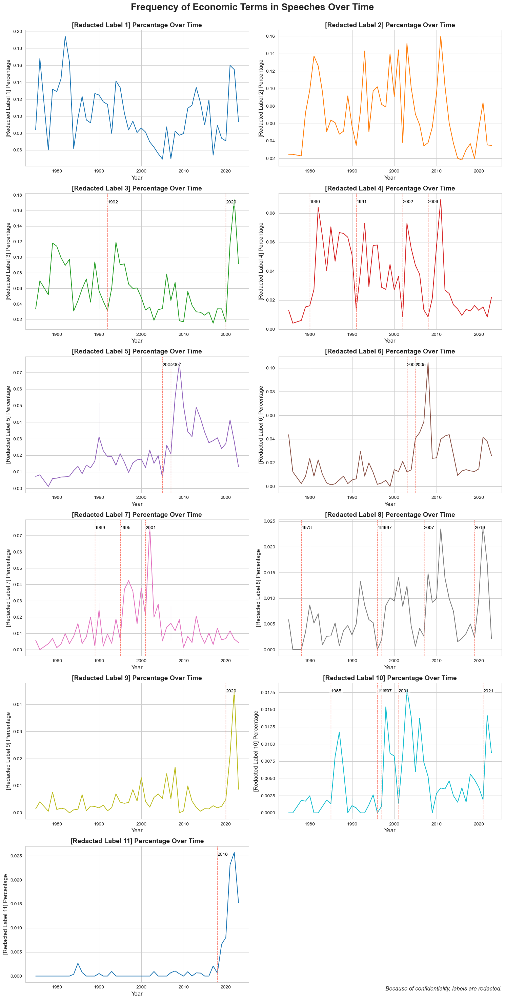

# **Research Experience**

Here is a summary of my contributions to ongoing research projects.

## **Text-based Analysis using Novel Dataset**

We used a novel dataset of **U.S. congressional hearings**. After rigorously addressing *OCR reading errors* and [mapping database speakers](text-based-codes.md) to real-world congressmen, our next step is to train a **BERT topic model** to condense hundreds of thousands of speeches in the dataset into *500 topics*. 

### Plot 1
Following fine-tuning (including *embedding pretraining*, *vectorizer model*, *UMAP model*, *HDBSCAN model*, *c-TF-IDF model*, and *representation model*), this is an interactive map of the **top 20 most frequent topics**. Feel free to explore the data:

<iframe src="/assets/plots/topic_500.html" width="100%" height="1000px" style="border:none;"></iframe>

### Plot 2
Here is another plot which depicits the frequency of how congressmen mentions a certain redacted label over time, labelled by AI-Large Language Models (LLMs). 

{ align=left }


## **The Casual Impact of Fiscal Shock**

This research investigates how government deficits and public debt levels influence asset prices and macroeconomic conditions. Using event study methodology, we analyze periods where UK budget deficit news emerged independently of economic conditions, addressing the omitted variable bias challenge (OVB). We employ **Large Language Models (LLMs)** to extract **budget surprises** from news data and examine their impact on financial markets.

We obtained `q1_ratio` by utilizing an AI LLMs to assess news articles related to budget announcements. For each article, the model answered two specific questions about whether the news would cause the budget deficit to increase or decrease. The responses were categorized as 'up', 'down', or 'unsure'. The `q1_ratio` is calculated as a normalized measure using the proportions of 'up' and 'down' responses:

$$\text{q1_ratio} = \frac{\text{q1_up} - \text{q1_down}}{\text{q1_up} + \text{q1_down}}$$

Then, we conducted following regression analysis:

```
q1_ratio ~ 10.0_n_d + gbpeur_o_d
```

- `10.0_n_d`: *change* in UK 10-year bond yield between announcement date `t+5` and `t-1`  

- `gbpeur_o_d`: *change* in GBP/EUR Exchange Rate between announcement date `t+5` and `t-1`  

Here are the preliminary regression results:

```
                            OLS Regression Results                            
==============================================================================
Dep. Variable:               10.0_n_d   R-squared:                       0.399
Model:                            OLS   Adj. R-squared:                  0.373
Method:                 Least Squares   F-statistic:                     15.25
Date:                Sat, 02 Nov 2024   Prob (F-statistic):           1.03e-07
Time:                        23:57:16   Log-Likelihood:                 45.267
No. Observations:                  73   AIC:                            -82.53
Df Residuals:                      69   BIC:                            -73.37
Df Model:                           3                                         
Covariance Type:            nonrobust                                         
===============================================================================
                  coef    std err          t      P>|t|      [0.025      0.975]
-------------------------------------------------------------------------------
const           0.0379      0.021      1.782      0.079      -0.005       0.080
q1_ratio        0.1712      0.050      3.417   0.001***       0.071       0.271
gbpeur_o_d     -5.7955      1.356     -4.273   0.000***      -8.501      -3.090
interaction   -11.7326      2.721     -4.312   0.000***     -17.161      -6.304
==============================================================================
Omnibus:                        0.705   Durbin-Watson:                   1.541
Prob(Omnibus):                  0.703   Jarque-Bera (JB):                0.228
Skew:                           0.022   Prob(JB):                        0.892
Kurtosis:                       3.270   Cond. No.                         186.
==============================================================================

Notes:
[1] Standard Errors assume that the covariance matrix of the errors is correctly specified.
```

The regression results indicate a **significant positive relationship** between `q1_ratio` and the change in UK ten-year government bond yields (`10.0_n_d`). Specifically, a higher `q1_ratio` — implying **stronger public expectation of an increasing budget deficit** — is associated with an **increase in bond yields**. The coefficient for `q1_ratio` is positive and statistically significant at the 1% level. Additionally, the negative coefficients for the change in the GBP/EUR exchange rate (`gbpeur_o_d`) and the interaction term suggest that currency appreciation and its interplay with budget expectations also influence bond yields. These findings support the hypothesis that anticipated fiscal expansions lead investors to demand higher yields on government bonds, reflecting the pricing-in of budget deficit expectations into asset prices.